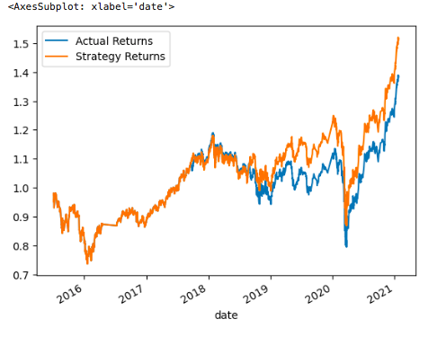
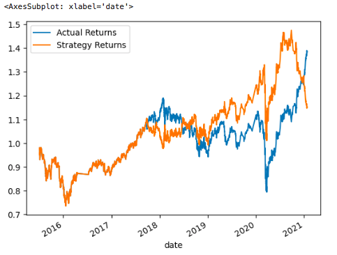

# Module_14_Challenge_Python_Algorithmic_Trading

## Background
For this Challenge, you’ll assume the role of a financial advisor at one of the top five financial advisory firms in the world. Your firm constantly competes with the other major firms to manage and automatically trade assets in a highly dynamic environment. In recent years, your firm has heavily profited by using computer algorithms that can buy and sell faster than human traders.

The speed of these transactions gave your firm a competitive advantage early on. But, people still need to specifically program these systems, which limits their ability to adapt to new data. You’re thus planning to improve the existing algorithmic trading systems and maintain the firm’s competitive advantage in the market. To do so, you’ll enhance the existing trading signals with machine learning algorithms that can adapt to new data.

## What You're Creating
You’ll combine your new algorithmic trading skills with your existing skills in financial Python programming and machine learning to create an algorithmic trading bot that learns and adapts to new data and evolving markets.

In a Jupyter notebook, you’ll do the following:

Implement an algorithmic trading strategy that uses machine learning to automate the trade decisions.

Adjust the input parameters to optimise the trading algorithm.

Train a new machine learning model and compare its performance to that of a baseline model.

### The steps for this Challenge are divided into the following sections:

Establish a Baseline Performance

Tune the Baseline Trading Algorithm

Evaluate a New Machine Learning Classifier

Create an Evaluation Report

---

`Evaluation Report:`

> Support Vector Machine (SVM) model returns plot:

Analysis:

Overall, the SVM tuned baseline model does not perform very well based on the metrics in the classification report; the accuracy of the model was 55% and the recall scores for variables -1 and 1, were 4% and 96% respectivley. However, the high recall score for this model for variable 1(buying) indicates it does a pretty good job predicting profitable long-term investment opportunities. Also, based on the plot above, the strategy returns look to be in line for most of the time the analysis covers, at some points in time providing higher returns than the actuals. The use of this model would ultimatley depend on the class you might be trying to predict, but it would need improvement and further development.

> Logistic Regression (LR) Classification model returns plot:

Analysis:

The new model, using logisitic regression classifier, does not perform better than the baseline model based on the metrics in the classification report; the accuracy of the model was 52% and the recall scores for variables -1 and 1, were 33% and 66% respectivley. Although, the strategy returns predictions look to be trending higher than the actual returns for most of the time after 2020 in the case of the comparison with the use of the logistic regression model. The use of this model would ultimatley depend on the class you might be trying to predict, but it would need improvement and further development.

`Comparison:`

After comparsion of the SVM model and the new model using Logistic regression, the SVM model performs slightly better than the logistic regression model based on overall accuracy. However, the higher recall score for the new model in terms of variable class -1, indicates it would do a better job than the SVM model in predicting profitable short selling opportunities. Both models ultimatley do not perform very well and could use some further development; the use of either model would depend on the use case of the analysis. 

